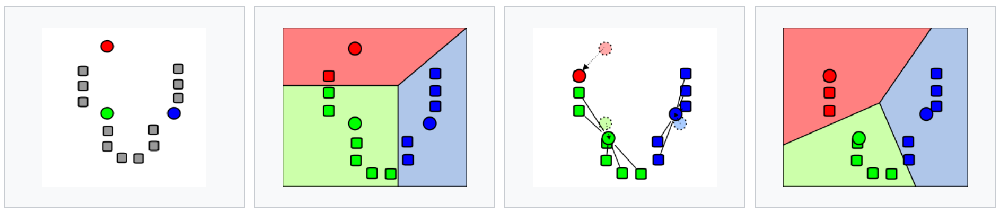

# **El algoritmo k-means**

_k-means_ es un algoritmo **no supervisado** que se utiliza para **agrupar** observaciones que comparten características similares (clústers). Partición de un conjunto de _n_ observaciones en _k_ grupos o clústers. ¿No supervisado? Sí, significa que las observaciones dadas en el conjunto de datos no están etiquetadas, no hay ningún resultado que predecir. El algoritmo sigue los siguientes pasos:

1. **Inicialización**. Se establecen _k_ centroides en el espacio de los datos, escogidos aleatoriamente. El valor _k_ lo indica el usuario al ejecutar el algoritmo. 

    - Método de Forgy. Elige aleatoriamente _k_ observaciones del conjunto de datos y las utiliza como centroides. Tiende a dispersar los centroides iniciales.
    - Método de partición aleatoria. Asigna aleatoriamente un clúster para cada observación y después procede a la etapa de actualización. Ubica los centroides cerca del               centro del conjunto de datos.

2. **Asignación**. Cada observación de los datos es asignada a su centroide más cercano, utilizando la distancia euclidiana.

3. **Actualización**. Se actualiza la posición del centroide de cada grupo, tomando como nuevo centroide la posición del promedio de las observaciones pertenecientes.

4.- Repetir los pasos 2 y 3 hasta que los centroides no se mueven, o se mueven por debajo de una distancia umbral.

¿Cuál es el objetivo? Una segmentación óptima es aquella donde las observaciones pertenecientes a un mismo grupo son lo más homogéneas posible y las observaciones pertenecientes a distintos grupos son lo más heterogéneas posible. La varianza dentro de grupos debe ser reducida (observaciones dentro de un mismo grupo tienen que ser similares) y la varianza entre grupos debe ser grande (observaciones de distintos grupos tienen que ser distintas). 

Por tanto, el algoritmo _k-means_ resuelve un problema de optimización, siendo la función a optimizar (minimizar) la suma de las distancias de cada objeto al centroide de su cluster. Otro criterio podría ser el de maximizar la suma de distancias entre grupos.

**Ventajas**: Simple, flexible y eficiente. Los resultados son fáciles de interpretar.

**Inconvenientes**: Definir número de grupos (_elbow method_). Resultado varía en función de la semilla escogida en la inicialización. Sensible a _outliers_.

# **Ejemplo**

</a>

 

1. En la primera imagen, _k-means_ genera aleatoriamente tres centroides en el espacio de los datos ($k=3$). No se ha empleado el método de Forgy, puesto que no ha utilizado observaciones de los datos como centroides iniciales.

2. En la segunda imagen, se asocia cada observación al centroide más cercando, formando tres clusters. Las particiones se representan mediante diagramas de Voronoi.

3. A continuación, se actualiza la posición del centroide de cada grupo, en función del promedio de las observaciones pertenecientes. En el grupo rojo sólo hay una observación, por eso el centroide se coloca justo encima de ella.

4. Se repiten los pasos 2 y 3 hasta que se logre la convergencia.
